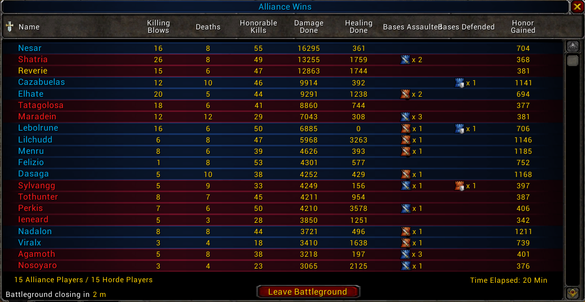
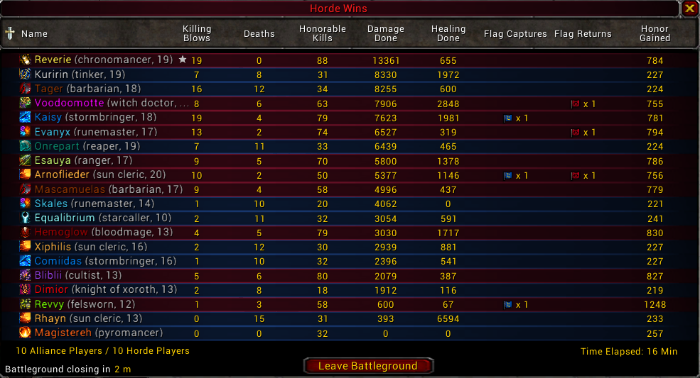

# Enhanced Battleground Scoreboard

A lightweight World of Warcraft addon that enhances the default battleground scoreboard by making player classes instantly recognizable.

## Features

- Colorizes player names using their class colors.
- Displays class icons next to every player.
- Shows each player's class name.
- Shows their levels (only if not lvl 60) (in case of enemies, you have to target them at least once during battleground)

## Comparison

### Before

### After

## Compatibility

The addon is primarily developed for:

- **Ascension WoW: Conquest of Azeroth** (supports all 21 custom classes)

It should also work on:

- Other Ascension WoW realms
- Most Wrath of the Lich King (3.3.x) clients that use the standard Blizzard battleground scoreboard (untested)

## Installation

1. Navigate to [releases](https://github.com/naijaro/wow-enhanced-battleground-scoreboard/releases)
2. Download the latest EnhancedBattlegroundScoreboard.zip
3. Unzip it into your `Interface/AddOns` directory.
4. Launch the game (or reload your UI with `/reload`).
5. Join a battleground and press **Tab** to open the scoreboard.
